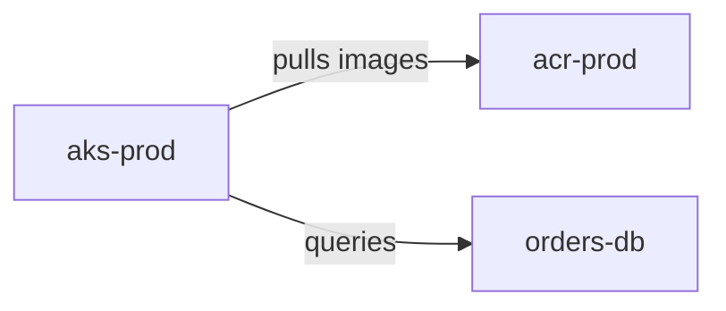

# Mermaid To Diagrams

Mermaid To Diagrams is a .NET 10 C# CLI that converts a constrained Mermaid flowchart syntax into Python Diagrams scripts and, when Python Diagrams plus Graphviz are available, renders Azure architecture diagrams with Azure icons.

The project is intentionally deterministic: Azure resource types are not guessed from prose labels. Mermaid node IDs encode the exact Python Diagrams Azure category and class name.

## Repository Layout

```text
MermaidToDiagrams.sln          classic Visual Studio solution
MermaidToDiagrams.slnx         XML solution for newer .NET tooling
src/MermaidToDiagrams.CLI/      .NET 10 CLI implementation
src/MermaidToDiagrams.CLI/catalogs/azure-icons.json
                                bundled Azure icon catalog used by the resolver
src/MermaidToDiagrams.GUI/      Windows Forms GUI wrapper around the CLI
src/MermaidToDiagrams.API/      ASP.NET Core REST API wrapper around the CLI
src/MermaidToDiagrams.MCP/      ASP.NET Core MCP Streamable HTTP server around the CLI
src/MermaidToDiagrams.Shared/   shared GUI/API/MCP eligibility checks and CLI runner
samples/reference-architectures/ 20 deterministic Azure architecture fixtures
installer/MermaidToDiagrams.iss Inno Setup installer script
tools/build-python-runtime.ps1  stages Python, diagrams, and Graphviz runtime files
tools/package-win-x64.ps1       publishes the CLI and builds the installer
plan.md                         implementation plan and design contract
```

## Solution Architecture

Open [MermaidToDiagrams.sln](MermaidToDiagrams.sln) in Visual Studio to load the whole solution. The solution contains:

- `MermaidToDiagrams.CLI`: the conversion authority. It parses Mermaid, resolves Azure node IDs, emits Python Diagrams scripts, and optionally renders through Python Diagrams and Graphviz.
- `MermaidToDiagrams.Shared`: common wrapper logic used by GUI, API, and MCP. It contains eligibility validation, CLI path resolution, CLI process execution, temp file handling, and conversion orchestration.
- `MermaidToDiagrams.GUI`: Windows Forms desktop wrapper for file selection, pasted Mermaid text, eligibility analysis, confirmation, and conversion status.
- `MermaidToDiagrams.API`: IIS-hostable REST wrapper that accepts Mermaid JSON payloads and returns validation errors or rendered diagram bytes.
- `MermaidToDiagrams.MCP`: IIS-hostable Model Context Protocol server using Streamable HTTP and the official C# MCP SDK.

The non-CLI hosts intentionally call `m2d.exe` instead of linking directly to CLI internals. This keeps the CLI behavior as the single conversion contract across desktop, REST, and MCP surfaces.

## Build

Requirements for development:

- .NET SDK 10
- Windows PowerShell or PowerShell 7
- Visual Studio with .NET 10 support, if using the IDE

Build the entire solution:

```powershell
dotnet build .\MermaidToDiagrams.sln
```

Run directly from source:

```powershell
dotnet run --project .\src\MermaidToDiagrams.CLI -- --help
```

Run the GUI wrapper:

```powershell
dotnet run --project .\src\MermaidToDiagrams.GUI
```

Run the API wrapper locally:

```powershell
dotnet run --project .\src\MermaidToDiagrams.API --urls http://localhost:5088
```

Run the MCP wrapper locally:

```powershell
dotnet run --project .\src\MermaidToDiagrams.MCP --urls http://127.0.0.1:5110
```

## Usage

### GUI

The GUI lets you:

- Load a `.mmd` or `.mermaid` file.
- Paste Mermaid text from the clipboard.
- Analyze conversion eligibility before rendering.
- Review local syntax/convention issues as a list.
- Run CLI validation and inspect captured CLI output.
- Confirm conversion before the CLI `render` command starts.
- Check Python rendering dependencies and try to install missing Python packages before conversion.
- Surface CLI conversion errors back into the GUI output panel.
- Start over with another file, the same file, or new pasted text.

The GUI performs a local eligibility check first. It verifies that the source is not empty, contains a supported `flowchart` or `graph` declaration, includes the required `m2d` strict/convention decorators, uses deterministic Azure node IDs, and avoids unsupported reverse/bidirectional arrows. If local checks pass, it calls `m2d validate`. If validation succeeds, the conversion button is enabled. When conversion starts, the GUI calls `m2d ensure-dependencies --install` before `m2d render`; this runs Python to import `diagrams` and `graphviz`, checks for Graphviz `dot`, and attempts to install missing Python packages with pip.

### REST API

The API is an ASP.NET Core app intended for IIS hosting. It shares the same eligibility checker and CLI runner used by the GUI.

Endpoints:

```text
GET  /health
POST /api/validate
POST /api/convert
POST /api/convert/base64
```

Validation request:

```json
{
  "mermaid": "%% m2d: strict = true %%\n%% m2d: title = Example %%\n%% m2d: convention = az_<category>_<ClassName>__<logicalId> %%\nflowchart LR\n  az_compute_KubernetesServices__aks[\"AKS\"]\n  az_compute_ContainerRegistries__acr[\"ACR\"]\n  az_compute_KubernetesServices__aks -->|pulls images| az_compute_ContainerRegistries__acr"
}
```

Conversion request:

```json
{
  "mermaid": "...",
  "format": "png",
  "theme": "azure-modern",
  "includePython": false
}
```

`POST /api/convert` returns the rendered diagram as binary content with the correct content type. `POST /api/convert/base64` returns JSON with `diagramBase64`, `format`, `contentType`, optional generated Python, and CLI output. Validation or conversion failures return JSON with an `errors` array and captured CLI output.

Publish an IIS-ready API payload:

```powershell
.\tools\publish-api-iis.ps1
```

The script publishes the API to `artifacts/publish/iis-api` and publishes `m2d.exe` under `artifacts/publish/iis-api/cli`. In IIS, point the site/application to `artifacts/publish/iis-api` or copy that folder to the server. The application pool identity must be able to execute `cli\m2d.exe` and write temp files. You can override CLI location with either:

If `artifacts/runtime` exists, the script also copies it to `artifacts/publish/iis-api/cli/runtime`, which is where the CLI expects the private Python and Graphviz runtime. Without that runtime, validation can still work, but rendering requires compatible Python Diagrams and Graphviz on `PATH`.

```powershell
setx MERMAID_TO_DIAGRAMS_CLI_PATH "C:\path\to\m2d.exe"
```

or `appsettings.json`:

```json
{
  "MermaidToDiagrams": {
    "CliPath": "C:\\path\\to\\m2d.exe"
  }
}
```

### MCP Server

`MermaidToDiagrams.MCP` is an ASP.NET Core MCP server using the official C# SDK package `ModelContextProtocol.AspNetCore`. It exposes a Streamable HTTP MCP endpoint at:

```text
/mcp
```

It also exposes a normal health check endpoint:

```text
GET /health
```

Available MCP tools:

```text
validate_mermaid_azure_diagram
convert_mermaid_azure_diagram
```

`validate_mermaid_azure_diagram` accepts:

```json
{
  "mermaid": "%% m2d: strict = true %%\n..."
}
```

`convert_mermaid_azure_diagram` accepts:

```json
{
  "mermaid": "%% m2d: strict = true %%\n...",
  "format": "png",
  "theme": "azure-modern",
  "includePython": false
}
```

The conversion tool returns JSON as MCP text content. Successful results include `diagramBase64`, `format`, `contentType`, optional `pythonScript`, and captured CLI output. Validation or conversion failures include `success = false`, an `errors` array, and CLI diagnostics.

Publish an IIS-ready MCP payload:

```powershell
.\tools\publish-mcp-iis.ps1
```

The script publishes the MCP server to `artifacts/publish/iis-mcp` and publishes `m2d.exe` under `artifacts/publish/iis-mcp/cli`. If `artifacts/runtime` exists, it is copied under `cli/runtime` so the CLI can find private Python and Graphviz.

MCP hosting notes:

- Configure the IIS application pool identity with execute permission for `cli\m2d.exe`.
- Configure `AllowedHosts` for the exact IIS host name.
- Configure `Mcp:AllowedOrigins` for trusted browser/client origins.
- Keep the server behind HTTPS and normal IIS authentication/authorization controls when exposed beyond localhost.
- The server uses stateless Streamable HTTP, which avoids session affinity requirements for this tool-only workload.

### CLI

Validate a Mermaid file:

```powershell
dotnet run --project .\src\MermaidToDiagrams.CLI -- validate .\samples\reference-architectures\09-aks-microservices-basic.mmd
```

Generate a Python Diagrams script:

```powershell
dotnet run --project .\src\MermaidToDiagrams.CLI -- emit-python .\samples\reference-architectures\19-foundry-chat-rag.mmd --output .\out\foundry-chat-rag.py
```

Render a diagram:

```powershell
dotnet run --project .\src\MermaidToDiagrams.CLI -- render .\samples\reference-architectures\19-foundry-chat-rag.mmd --output .\out\foundry-chat-rag --format png --emit-python
```

Rendering requires Python with the `diagrams` and `graphviz` Python packages plus native Graphviz `dot.exe`. The installer is designed to deploy those as a private runtime under the application folder. During development, `render` also works if `python.exe` and `dot.exe` are on `PATH`.

Inspect supported icons:

```powershell
dotnet run --project .\src\MermaidToDiagrams.CLI -- inspect-icons --query aks
dotnet run --project .\src\MermaidToDiagrams.CLI -- list-icons --category compute
```

Regenerate the Azure icon catalog from an installed Python Diagrams package:

```powershell
python .\tools\generate-azure-catalog.py .\src\MermaidToDiagrams.CLI\catalogs\azure-icons.json
```

Check runtime state:

```powershell
dotnet run --project .\src\MermaidToDiagrams.CLI -- doctor
```

Check rendering dependencies and try to install missing Python packages:

```powershell
dotnet run --project .\src\MermaidToDiagrams.CLI -- ensure-dependencies --install
```

## Compatible Mermaid Authoring Rules

Use Mermaid `flowchart` or `graph` syntax with one of these directions:

- `LR`
- `RL`
- `TB`
- `TD`
- `BT`

Every Azure resource node should use this deterministic ID format:

```text
az_<category>_<ClassName>__<logicalId>
```

Examples:



The `category` and `ClassName` should match an entry in `src/MermaidToDiagrams.CLI/catalogs/azure-icons.json`. When an exact deterministic node ID is not in the bundled catalog, the CLI still emits `diagrams.azure.<category>.<ClassName>` and warns that Python render-time validation is required.

For cataloged entries, the generated Python import path is taken from the catalog, for example:

```text
az_compute_KubernetesServices__aks
  -> diagrams.azure.compute.KubernetesServices
```

Supported Mermaid constructs:

- Simple node declarations: `nodeId["Label"]`
- Directed edges: `a --> b`
- Labeled directed edges: `a -->|label| b`
- Dotted/thick edge hints where practical: `-.->`, `==>`
- `subgraph id["Label"] ... end`, emitted as Python Diagrams `Cluster`
- Metadata comments such as `%% m2d: title = My Architecture %%`

Recommended metadata:

```mermaid
%% m2d: strict = true %%
%% m2d: title = My Azure Architecture %%
%% m2d: source = https://learn.microsoft.com/... %%
%% m2d: convention = az_<category>_<ClassName>__<logicalId> %%
```

## Installer Packaging

### Creating `artifacts\runtime` locally

The CLI renderer looks for a private runtime in this layout:

```text
artifacts/runtime/
  python/
    python.exe
    Lib/site-packages/
      diagrams/
      graphviz/
  graphviz/
    bin/dot.exe
```

The easiest way to create it is to run the staging script:

```powershell
.\tools\build-python-runtime.ps1 -GraphvizBinDir "C:\Program Files\Graphviz"
```

What the script does:

1. Downloads the Python embeddable package into `artifacts/cache`.
2. Extracts it to `artifacts/runtime/python`.
3. Enables `import site` in the embeddable runtime `python*._pth` file.
4. Bootstraps `pip` with `get-pip.py`.
5. Installs Python packages into `artifacts/runtime/python/Lib/site-packages`.
6. Copies native Graphviz files into `artifacts/runtime/graphviz` when `-GraphvizBinDir` is supplied.

The exact `diagrams` install command used by the script is:

```powershell
.\artifacts\runtime\python\python.exe -m pip install --no-cache-dir --target .\artifacts\runtime\python\Lib\site-packages "diagrams==0.24.4" "graphviz==0.20.3"
```

The `diagrams` package is the Python module that provides `from diagrams import Diagram`, Azure node classes, and Python-side rendering helpers. The `graphviz` package installed by `pip` is only the Python wrapper. It does not include native Graphviz binaries; `dot.exe` must also be installed or copied separately.

If Graphviz is already installed locally, verify the root folder contains `bin\dot.exe`, then pass that root folder to the script:

```powershell
Test-Path "C:\Program Files\Graphviz\bin\dot.exe"
.\tools\build-python-runtime.ps1 -GraphvizBinDir "C:\Program Files\Graphviz"
```

If Graphviz is installed somewhere else, use that directory instead. The value passed to `-GraphvizBinDir` must be the Graphviz root directory, not the `bin` directory.

Verify the Python packages:

```powershell
.\artifacts\runtime\python\python.exe -c "import diagrams, graphviz; print(diagrams.__file__); print(graphviz.__version__)"
```

Verify native Graphviz:

```powershell
.\artifacts\runtime\graphviz\bin\dot.exe -V
```

Then verify the CLI can see the runtime after publishing:

```powershell
dotnet publish .\src\MermaidToDiagrams.CLI\MermaidToDiagrams.CLI.csproj -c Release -f net10.0 -r win-x64 --self-contained true -p:PublishSingleFile=true -o .\artifacts\publish\win-x64
Copy-Item .\artifacts\runtime .\artifacts\publish\win-x64\runtime -Recurse -Force
.\artifacts\publish\win-x64\m2d.exe doctor
```

Stage Python and Python package dependencies:

```powershell
.\tools\build-python-runtime.ps1 -GraphvizBinDir "C:\Program Files\Graphviz"
```

That script stages:

- Python embeddable runtime
- `diagrams` Python package
- Python `graphviz` package
- native Graphviz files when `-GraphvizBinDir` is supplied

Build the Windows installer with Inno Setup:

```powershell
.\tools\package-win-x64.ps1 -InnoCompiler "C:\Program Files (x86)\Inno Setup 6\ISCC.exe"
```

The installer copies the compiled CLI, private Python runtime, Graphviz runtime, catalog, README, plan, and sample Mermaid files. It can optionally add the app directory to the user `PATH`.

## Limitations

- This is a v1 Mermaid subset parser, not a complete Mermaid implementation.
- Only Azure diagrams are supported.
- The bundled catalog currently contains the Azure icon classes needed by the included reference samples plus common aliases. Deterministic IDs outside the catalog are emitted as `diagrams.azure.<category>.<ClassName>`, but only Python Diagrams can finally prove that the class exists.
- Reverse and bidirectional Mermaid arrows are rejected. Write edges in the direction you want rendered.
- Mermaid styling, `classDef`, custom shapes, Markdown labels, HTML labels, links, and advanced layout directives are not rendered.
- Clusters are supported, but nested cluster layout is ultimately controlled by Graphviz.
- Rendering quality depends on Python Diagrams and Graphviz layout behavior.
- The GUI asks the CLI to install missing Python packages before conversion, but native Graphviz `dot.exe` still must come from the bundled runtime or a Graphviz installation on `PATH`.

## Reference Fixtures

The `samples/reference-architectures` directory contains 20 Azure architectures ranging from static websites and basic web apps through AKS, hub-spoke networking, data pipelines, IoT analytics, Azure AI Foundry chat/RAG, and SAP S/4HANA. They are intended as regression fixtures for parser, resolver, and Python emitter behavior.
