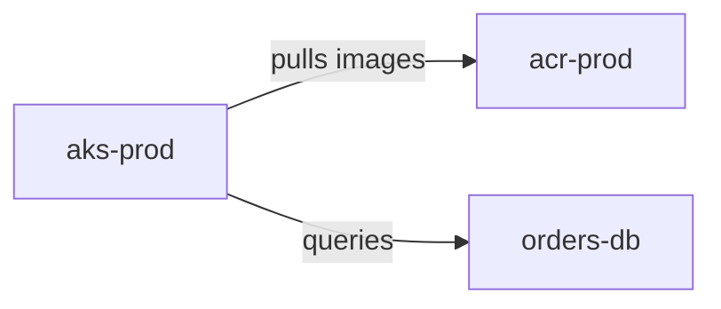

# Implementation Plan: .NET 10 Mermaid-To-Azure-Diagrams CLI

As of June 11, 2026, .NET 10 is a supported LTS target, with Microsoft lifecycle support listed through November 14, 2028. The cleanest Windows distribution is a self-contained `win-x64` .NET CLI plus a private Python and Graphviz runtime, installed by Inno Setup.

## 1. Product Scope

Build a Windows-first CLI named `mermaid2diagrams` or `m2d`.

Supported input for v1:

- Mermaid `flowchart` / `graph` diagrams.
- Directions: `TB`, `TD`, `BT`, `LR`, `RL`.
- Nodes with labels and common shapes.
- Edges: directed, reverse, undirected, labeled, dotted/thick variants where practical.
- `subgraph ... end` mapped to Python Diagrams `Cluster`.
- Comments and optional converter metadata.

Unsupported v1 input should fail with precise diagnostics, not silently render wrong diagrams.

CLI shape:

```powershell
m2d render input.mmd --output out/architecture --format png --emit-python --strict
m2d validate input.mmd
m2d inspect-icons --query aks
m2d list-icons --category compute
```

## 2. Deterministic Azure Naming Convention

Create a documented convention that lets Mermaid identify Azure resources without guessing.

Preferred node ID format:



Resolver precedence:

1. Explicit metadata comment: `%% m2d: node aks = diagrams.azure.compute.KubernetesServices %%`
2. Explicit node ID: `az_<category>_<ClassName>__<logicalId>`.
3. Mermaid class tag: `class aks az_compute_KubernetesServices`.
4. Label hint: `aks["{az:compute.KubernetesServices} aks-prod"]`.
5. Curated alias map: `AKS`, `ACR`, `VMSS`, `SQLDB`, `KV`, `VNET`, etc.
6. Exact normalized catalog match.
7. If ambiguous or unknown: fail in `--strict`, warn or use generic fallback only when requested.

No fuzzy matching in render mode. Fuzzy suggestions are allowed only in `validate` and `inspect-icons`.

## 3. Solution Architecture

Recommended projects:

```text
src/
  MermaidToDiagrams.CLI/
  MermaidToDiagrams.Core/
  MermaidToDiagrams.Mermaid/
  MermaidToDiagrams.AzureCatalog/
  MermaidToDiagrams.PythonEmit/
  MermaidToDiagrams.Rendering/
tests/
  MermaidToDiagrams.Tests/
  MermaidToDiagrams.GoldenTests/
installer/
  MermaidToDiagrams.iss
tools/
  build-python-runtime.ps1
  generate-azure-catalog.py
  smoke-render.ps1
samples/
```

Core pipeline:

```text
Mermaid text
  -> lexer/parser
  -> Mermaid AST
  -> normalized diagram model
  -> Azure type resolver
  -> Python Diagrams script
  -> vendored python.exe executes script
  -> Graphviz renders png/svg/pdf/dot
```

## 4. Parser Design

Implement a small C# lexer/parser for the supported flowchart subset rather than regex-only parsing.

Data model:

```csharp
DiagramModel(Direction, Nodes, Edges, Clusters, Metadata)
NodeModel(Id, Label, Shape, ClusterPath, TypeHint, SourceSpan)
EdgeModel(From, To, Direction, Label, Style, MinLength, SourceSpan)
ClusterModel(Id, Label, Direction, Children)
```

Diagnostics must include line/column, original token, and suggested fix.

Examples:

- Unknown resource type: suggest `az_compute_VirtualMachine__web`.
- Ambiguous `AppServices`: ask for `azure.appservices.AppServices`, `azure.compute.AppServices`, or `azure.containers.AppServices`.
- Unsupported Mermaid construct: say exactly which feature is unsupported.

## 5. Azure Icon Catalog

Generate `azure-icons.json` from the installed Python `diagrams` package during build, not by hand.

Catalog generator steps:

- Import `diagrams.azure.*` modules with Python.
- Discover node classes and aliases.
- Record canonical import path, category, class name, normalized keys, aliases.
- Merge a curated `azure-aliases.yaml`.
- Validate every catalog entry by emitting and importing it.

Example catalog item:

```json
{
  "provider": "azure",
  "category": "compute",
  "className": "KubernetesServices",
  "importPath": "diagrams.azure.compute.KubernetesServices",
  "aliases": ["aks", "kubernetesservice", "kubernetesservices"]
}
```

This matters because Python Diagrams has many Azure modules and duplicate names across categories.

## 6. Python Script Generation

Generate safe Python code from the normalized model.

Rules:

- Never paste raw Mermaid into executable Python.
- Escape all labels with JSON/string literal escaping.
- Import only resolved catalog entries.
- Sort imports deterministically.
- Declare nodes once.
- Preserve Mermaid declaration order unless a stable layout option overrides it.
- Emit clusters as nested `with Cluster("..."):` blocks.
- Emit edges after all nodes exist.

Generated script pattern:

```python
from diagrams import Diagram, Cluster, Edge
from diagrams.azure.compute import KubernetesServices, ContainerRegistries
from diagrams.azure.databases import SQLDatabase

graph_attr = {
    "bgcolor": "transparent",
    "pad": "0.45",
    "nodesep": "0.65",
    "ranksep": "0.9",
    "splines": "ortho",
    "fontname": "Segoe UI"
}

with Diagram(
    "architecture",
    filename=r"C:\out\architecture",
    outformat="png",
    show=False,
    direction="LR",
    graph_attr=graph_attr
):
    nodes = {}
    nodes["aks"] = KubernetesServices("aks-prod")
    nodes["acr"] = ContainerRegistries("acr-prod")
    nodes["orders"] = SQLDatabase("orders-db")

    nodes["aks"] >> Edge(label="pulls images", color="#2563eb") >> nodes["acr"]
    nodes["aks"] >> Edge(label="queries", color="#334155") >> nodes["orders"]
```

## 7. Rendering Runtime

Bundle a private runtime under the app folder:

```text
{app}/m2d.exe
{app}/runtime/python/python.exe
{app}/runtime/python/Lib/site-packages/diagrams/...
{app}/runtime/graphviz/bin/dot.exe
{app}/catalogs/azure-icons.json
{app}/licenses/
```

The C# renderer should:

- Resolve absolute paths to bundled `python.exe` and `dot.exe`.
- Prepend `{app}\runtime\graphviz\bin` to the child process `PATH`.
- Set `PYTHONHOME`/`PYTHONPATH` only if required by the chosen Python packaging layout.
- Run Python without a shell.
- Capture stdout/stderr.
- Map Python import/render failures back to CLI diagnostics.
- Support `--keep-temp`, `--emit-python`, and `--emit-dot`.

Pin versions of:

- `diagrams`
- `graphviz` Python package
- Graphviz native binaries
- Python runtime

## 8. Packaging Python Dependencies

Use a build-time staging step, not install-time internet access.

Recommended approach:

- Use Python embeddable or targeted Python runtime extracted into `build/runtime/python`.
- Install wheels into a staging `site-packages`.
- Copy only runtime files into the installer payload.
- Include license files for Python, Diagrams, Graphviz, and transitive packages.
- Generate a dependency lock file and hash manifest.

Important: Python's Windows embeddable distribution is intended for app embedding, is isolated from the user system, does not include pip, and expects third-party packages to be vendored by the application installer.

## 9. .NET Build And Publish

Project file targets:

```xml
<TargetFramework>net10.0</TargetFramework>
<OutputType>Exe</OutputType>
<Nullable>enable</Nullable>
<ImplicitUsings>enable</ImplicitUsings>
<PublishSingleFile>true</PublishSingleFile>
<SelfContained>true</SelfContained>
<RuntimeIdentifier>win-x64</RuntimeIdentifier>
```

Publish command:

```powershell
dotnet publish src/MermaidToDiagrams.CLI `
  -c Release `
  -f net10.0 `
  -r win-x64 `
  --self-contained true `
  -p:PublishSingleFile=true `
  -o artifacts/publish/win-x64
```

Avoid Native AOT initially unless all dependencies and reflection paths are proven compatible.

## 10. Inno Setup Installer

Installer goals:

- Install compiled .NET CLI.
- Install private Python runtime.
- Install Python Diagrams and dependencies.
- Install bundled Graphviz.
- Install catalog/config/docs/samples.
- Optionally add CLI to PATH.
- Run a post-install smoke test.

Inno layout:

```ini
[Setup]
AppName=Mermaid To Diagrams
AppVersion={#AppVersion}
DefaultDirName={autopf}\MermaidToDiagrams
DefaultGroupName=Mermaid To Diagrams
ArchitecturesInstallIn64BitMode=x64
Compression=lzma2
SolidCompression=yes

[Files]
Source: "..\artifacts\publish\win-x64\*"; DestDir: "{app}"; Flags: recursesubdirs
Source: "..\artifacts\runtime\python\*"; DestDir: "{app}\runtime\python"; Flags: recursesubdirs
Source: "..\artifacts\runtime\graphviz\*"; DestDir: "{app}\runtime\graphviz"; Flags: recursesubdirs
Source: "..\catalogs\azure-icons.json"; DestDir: "{app}\catalogs"

[Icons]
Name: "{group}\Mermaid To Diagrams"; Filename: "{app}\m2d.exe"

[Run]
Filename: "{app}\m2d.exe"; Parameters: "doctor --quiet"; Flags: runhidden
```

Use `ISCC.exe` in CI to compile the `.iss` script.

## 11. Beautiful Render Defaults

Create named themes:

- `azure-modern`: clean white/transparent background, Segoe UI, blue-gray edges, orthogonal splines.
- `azure-dark`: dark background, light labels, high-contrast Azure icons.
- `docs`: SVG-first, transparent background, compact spacing.
- `poster`: high-DPI PNG/PDF, wider spacing.

Expose:

```powershell
m2d render arch.mmd --theme azure-modern --format svg
m2d render arch.mmd --theme docs --direction LR --ranksep 1.2
```

Do not over-style Azure icon nodes; the icon image is the main visual. Prefer Graphviz graph and edge styling.

## 12. Testing Strategy

Unit tests:

- Lexer/parser fixtures for Mermaid syntax.
- Type resolver fixtures for aliases, ambiguity, unknowns.
- Python emitter snapshot tests.
- Path escaping tests on Windows paths.

Golden tests:

- Mermaid input -> generated Python snapshot.
- Mermaid input -> DOT snapshot.
- Smoke render -> PNG/SVG exists and non-empty.

Installer tests:

- Install silently into a temp VM.
- Run `m2d doctor`.
- Render sample diagrams.
- Uninstall and verify private runtime files are removed.

Security tests:

- Labels containing quotes, newlines, semicolons, Python syntax, and shell metacharacters.
- Ensure generated Python treats all user text as data.

## 13. Documentation

Ship:

- `README.md`
- `docs/naming-conventions.md`
- `docs/supported-mermaid.md`
- `docs/azure-icon-resolution.md`
- `docs/installer.md`
- `samples/azure-basic.mmd`
- `samples/azure-hub-spoke.mmd`
- `samples/azure-aks-sql.mmd`

Include a `m2d doctor` command that prints:

- CLI version.
- .NET runtime mode.
- Bundled Python version.
- Diagrams version.
- Graphviz `dot` version.
- Catalog version.
- Render smoke-test status.

## References

- [.NET 10 lifecycle](https://learn.microsoft.com/en-us/lifecycle/products/microsoft-net-and-net-core)
- [.NET self-contained and single-file publishing](https://learn.microsoft.com/en-us/dotnet/core/deploying/)
- [System.CommandLine](https://learn.microsoft.com/en-us/dotnet/standard/commandline/)
- [Mermaid flowchart syntax](https://mermaid.ai/open-source/syntax/flowchart.html)
- [Python Diagrams installation](https://diagrams.mingrammer.com/docs/getting-started/installation)
- [Python Diagrams Azure icons](https://diagrams.mingrammer.com/docs/nodes/azure)
- [Python embeddable package on Windows](https://docs.python.org/3/using/windows.html#the-embeddable-package)
- [Inno Setup files documentation](https://jrsoftware.org/ishelp/topic_filessection.htm)
