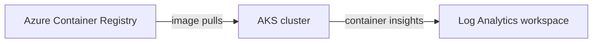
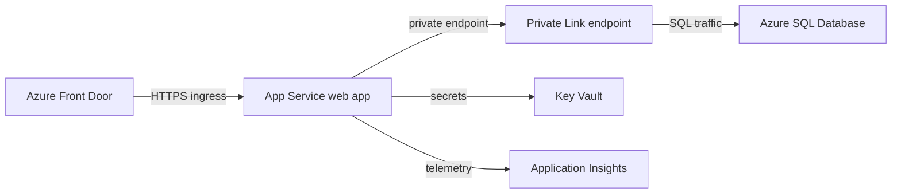
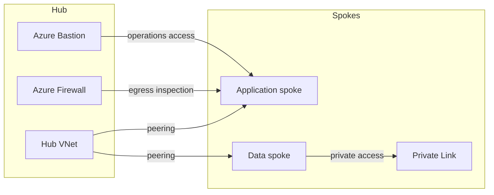

# Examples

## Minimal AKS Diagram

```mermaid
%% m2d: strict = true %%
%% m2d: title = AKS With Container Registry %%
%% m2d: convention = az_<category>_<ClassName>__<logicalId> %%
flowchart LR
  az_compute_ContainerRegistries__acr["Azure Container Registry"]
  az_compute_KubernetesServices__aks["AKS cluster"]
  az_monitor_LogAnalyticsWorkspaces__logs["Log Analytics workspace"]

  az_compute_ContainerRegistries__acr -->|image pulls| az_compute_KubernetesServices__aks
  az_compute_KubernetesServices__aks -->|container insights| az_monitor_LogAnalyticsWorkspaces__logs
```

## Web App With Private Data

```mermaid
%% m2d: strict = true %%
%% m2d: title = Web App With Private Data %%
%% m2d: convention = az_<category>_<ClassName>__<logicalId> %%
flowchart LR
  az_network_FrontDoors__frontdoor["Azure Front Door"]
  az_appservices_AppServices__web["App Service web app"]
  az_networking_PrivateLink__private_link["Private Link endpoint"]
  az_databases_SQLDatabase__sql["Azure SQL Database"]
  az_security_KeyVaults__keyvault["Key Vault"]
  az_monitor_ApplicationInsights__appinsights["Application Insights"]

  az_network_FrontDoors__frontdoor -->|HTTPS ingress| az_appservices_AppServices__web
  az_appservices_AppServices__web -->|private endpoint| az_networking_PrivateLink__private_link
  az_networking_PrivateLink__private_link -->|SQL traffic| az_databases_SQLDatabase__sql
  az_appservices_AppServices__web -->|secrets| az_security_KeyVaults__keyvault
  az_appservices_AppServices__web -->|telemetry| az_monitor_ApplicationInsights__appinsights
```

## Hub-Spoke Network

```mermaid
%% m2d: strict = true %%
%% m2d: title = Hub-Spoke Network %%
%% m2d: convention = az_<category>_<ClassName>__<logicalId> %%
flowchart LR
  subgraph az_hub["Hub"]
    az_networking_VirtualNetworks__hub_vnet["Hub VNet"]
    az_networking_Firewalls__firewall["Azure Firewall"]
    az_networking_Bastions__bastion["Azure Bastion"]
  end

  subgraph az_spokes["Spokes"]
    az_networking_VirtualNetworks__app_spoke["Application spoke"]
    az_networking_VirtualNetworks__data_spoke["Data spoke"]
    az_networking_PrivateLink__private_link["Private Link"]
  end

  az_networking_VirtualNetworks__hub_vnet -->|peering| az_networking_VirtualNetworks__app_spoke
  az_networking_VirtualNetworks__hub_vnet -->|peering| az_networking_VirtualNetworks__data_spoke
  az_networking_Firewalls__firewall -->|egress inspection| az_networking_VirtualNetworks__app_spoke
  az_networking_VirtualNetworks__data_spoke -->|private access| az_networking_PrivateLink__private_link
  az_networking_Bastions__bastion -->|operations access| az_networking_VirtualNetworks__app_spoke
```
